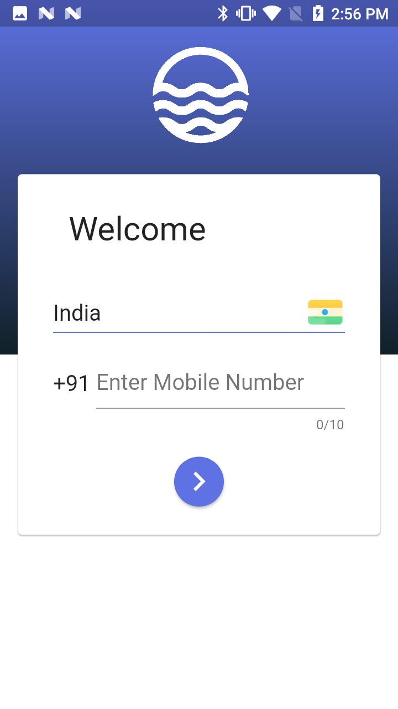
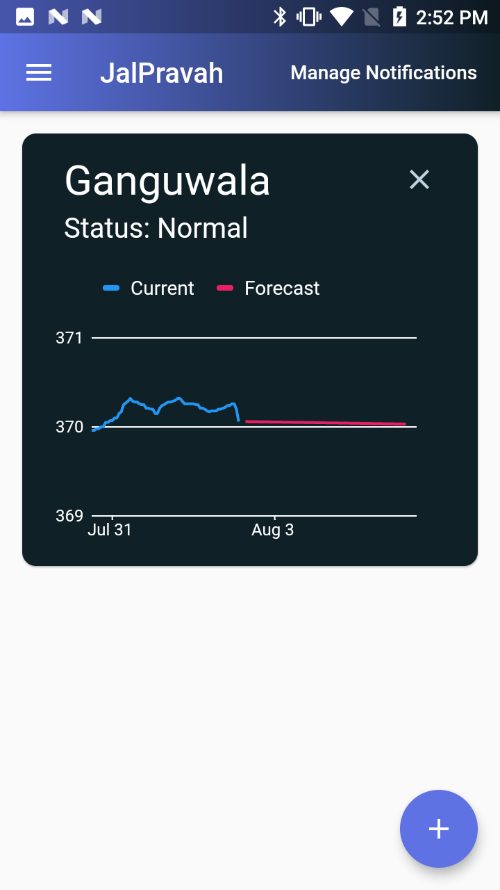
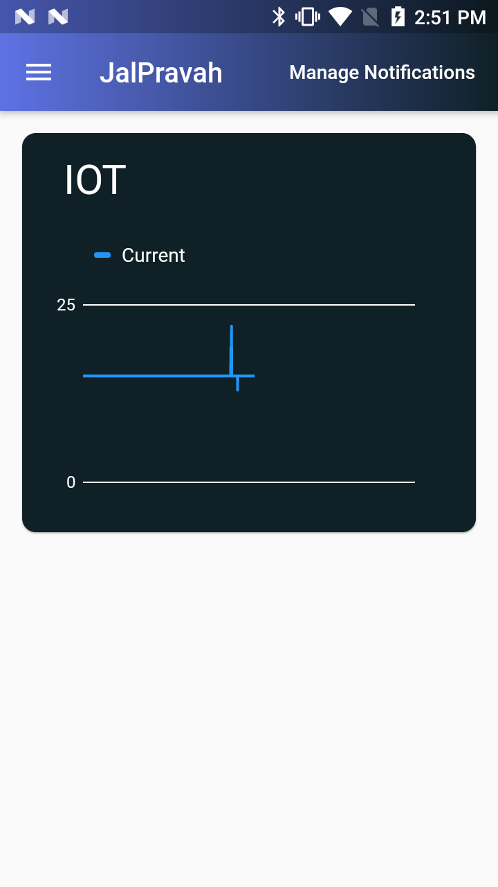

# JalPravah - CROSSS Coders


### Generate Hive Models

```bash
flutter packages pub run build_runner build --delete-conflicting-outputs
```

### Develop

```bash
flutter pub get
flutter run
```

### Screenshots

<p align="center">



</p>

&copy; 2020 CROSSS Coders
